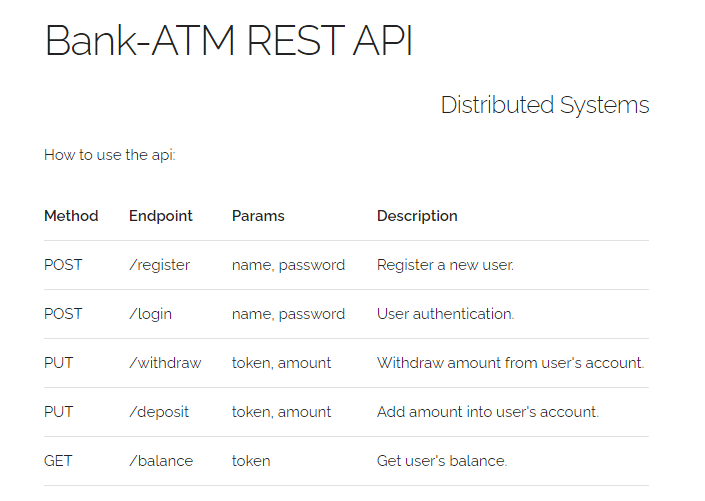

# ds-atm

#### Bank-ATM REST API

ds-atm is a simple REST API (Distributed Systems assignment) that has the functionality of an ATM used in banks.
Built with Flask/Python and Heroku Postgres.

Check it out [here](https://ds-atm.herokuapp.com).

## Usage


## Installation

ds-atm requires [Python](https://www.python.org/) 3 to run.
- Create a virtual environment.
- Install the dependencies from _requirements.txt_ and run the application using gunicorn.

```
python3 -m venv env
source env/bin/activate
pip install -r requirements.txt
gunicorn main:app
```